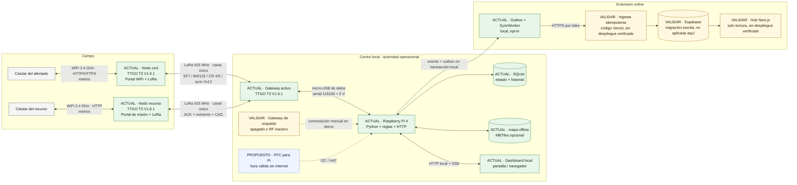
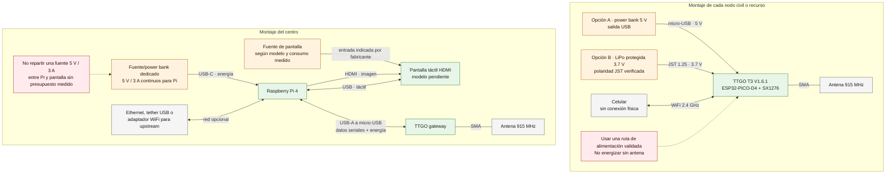
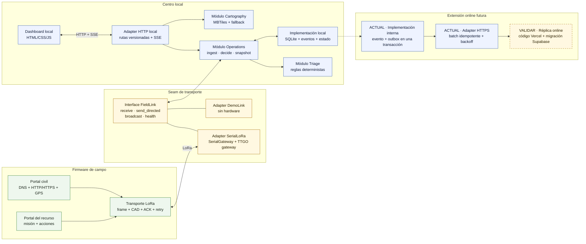
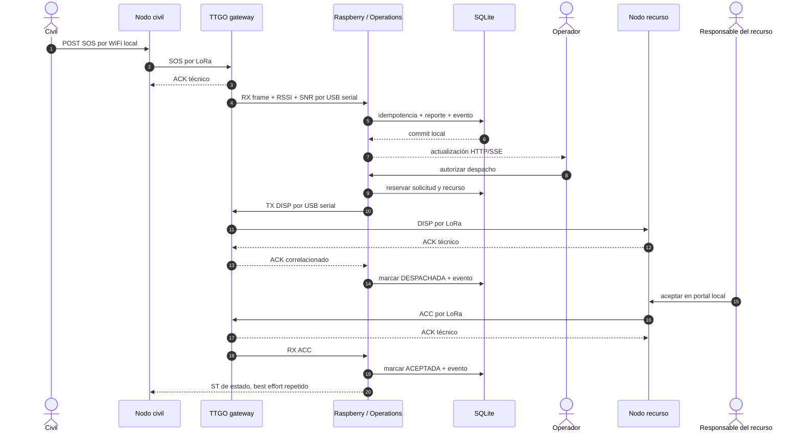

# WOKI · arquitectura de conexiones electrónicas y de software

Este documento es la fuente de verdad visual del sistema completo. Separa tres
escalas que no deben mezclarse en un solo dibujo: topología operacional, montaje
eléctrico y módulos de software.

Estado reconstruido desde el firmware, el command center y la documentación el
2026-08-23.

Entregables visuales listos:

- [Fuente editable draw.io con tres páginas](diagramas/woki-arquitectura.drawio).
- [Lámina vectorial SVG](diagramas/woki-arquitectura-sistema.svg).
- [Lámina PNG para presentaciones](diagramas/woki-arquitectura-sistema.png).

## 1. Decisión de representación

- **Mermaid en este repositorio** conserva la arquitectura junto al código, se
  puede revisar en Git y se puede pegar en draw.io para obtener un lienzo editable.
- **draw.io / diagrams.net** es la salida recomendada para la lámina de presentación:
  permite importar Mermaid, incorporar las imágenes del diseño 3D y exportar SVG o PNG.
- **KiCad** será la fuente de verdad eléctrica si se agrega una placa propia,
  distribución de potencia, sensores o un RTC cableado. El esquema actual usa placas
  integradas y cables comerciales, por lo que la tabla de conexiones es suficiente.
- **Excalidraw** sirve para discutir ideas en vivo, pero no como fuente de verdad final:
  sus conexiones y etiquetas se mantienen manualmente.

Referencias oficiales:

- Mermaid: <https://mermaid.js.org/syntax/architecture.html>
- Importar Mermaid en draw.io: <https://www.drawio.com/docs/tutorials/diagrams-from-code/>
- Diagramas técnicos en draw.io: <https://www.drawio.com/docs/getting-started/technical-diagrams/>
- Editor de esquemas de KiCad: <https://docs.kicad.org/10.0/en/eeschema/eeschema.pdf>
- Vistas breadboard/esquema de Fritzing: <https://fritzing.org/learning/get-started/project-view>
- Excalidraw: <https://github.com/excalidraw/excalidraw>
- Structurizr DSL, si WOKI crece a múltiples centros: <https://docs.structurizr.com/>

## 2. Leyenda de estado

| Marca | Significado |
|---|---|
| `ACTUAL` | Existe en el código o montaje vigente. |
| `VALIDAR` | Está diseñado, pero requiere prueba con hardware real. |
| `PROPUESTO` | Recomendación de arquitectura todavía no implementada. |
| `FUTURO` | Extensión deliberadamente fuera del circuito operacional offline. |

## 3. Vista 1 · sistema completo



### Regla de autoridad

El Centro local decide y conserva el estado operacional. El Hub online recibe una
réplica eventualmente consistente; no participa en el camino crítico `SOS → despacho →
aceptación → resolución`.

## 4. Vista 2 · conexiones físicas y energía

En los TTGO, ESP32, SX1276 y el OLED opcional comparten la misma PCB. Los GPIO de
la tabla siguiente son conexiones internas de la placa, no jumpers que deban cablearse.



### Matriz de conexiones externas

| Origen | Destino | Cable / medio | Transporta | Estado y regla |
|---|---|---|---|---|
| Power bank del nodo | TTGO de campo | USB-A → micro-USB | 5 V | `ACTUAL`; usar cable corto y probar autoapagado del power bank. |
| LiPo protegida | TTGO de campo | JST 1.25 | 3.7 V | `VALIDAR`; comprobar polaridad del lote antes de conectar. Es alternativa al power bank. |
| TTGO de campo | Antena | SMA | RF 915 MHz | `ACTUAL`; conectar antes de energizar. |
| Celular | TTGO de campo | WiFi 2.4 GHz | Portal y acciones | `ACTUAL`; no hay cable ni LoRa en el celular. |
| Fuente del centro | Raspberry Pi 4 | USB-C | 5 V / 3 A | `ACTUAL`; reserva esta capacidad para la Pi. |
| Raspberry Pi | TTGO gateway | USB-A → micro-USB de datos | 5 V + USB serial | `ACTUAL`; no usar cable de solo carga. |
| Raspberry Pi | Pantalla | HDMI | Video | `VALIDAR`; depende del modelo final. |
| Raspberry Pi | Pantalla | USB | Eventos táctiles | `VALIDAR`; la alimentación de la pantalla debe presupuestarse aparte. |
| TTGO gateway | Antena | SMA | RF 915 MHz | `ACTUAL`; separar físicamente de HDMI, reguladores y metal. |
| Raspberry Pi | Red externa | Ethernet, tether USB o adaptador WiFi | Internet eventual | `PROPUESTO`; no debe compartir el camino crítico offline. |
| Raspberry Pi | RTC compatible | HAT o I2C | Hora persistente | `PROPUESTO`; evita eventos con hora incorrecta después de reiniciar sin internet. |

### Conexiones internas documentadas del TTGO

| Función | GPIO |
|---|---:|
| SX1276 SCK | 5 |
| SX1276 MISO | 19 |
| SX1276 MOSI | 27 |
| SX1276 CS / NSS | 18 |
| SX1276 RST | 23 |
| SX1276 DIO0 | 26 |
| SX1276 DIO1 | 33 |
| OLED SDA, cuando existe | 21 |
| OLED SCL, cuando existe | 22 |

## 5. Vista 3 · arquitectura de software propuesta

El objetivo es conservar módulos profundos: pocas operaciones en su interfaz y la
complejidad de radio, reglas y persistencia localizada detrás de ellas.



### Interfaces recomendadas

#### Módulo `FieldLink`

Interface externa pequeña:

```text
receive(FieldFrame, LinkMetrics)
send_directed(FieldCommand) -> DeliveryResult
broadcast(FieldCommand) -> TransmissionResult
health() -> LinkHealth
```

La implementación oculta USB serial, correlación de ACK, reintentos, CAD, RSSI/SNR
y reconexión. Este seam ya es real porque existen dos adapters: radio física y demo.

#### Módulo `Operations`

Interface externa pequeña:

```text
ingest(FieldFrame, LinkMetrics) -> IngestResult
decide(OperationalCommand, Actor) -> DecisionResult
snapshot(Query) -> OperationalView
```

La implementación debe ocultar transiciones, idempotencia, reserva durante despacho,
triage, historial, escritura SQLite y creación de eventos sincronizables. El dashboard
no debe conocer frames de radio ni ejecutar SQL.

#### Persistencia

No se propone una interface abstracta para SQLite todavía: solo existe una
implementación necesaria. Se mantiene como seam interno de `Operations`. Introducir un
repositorio genérico ahora aumentaría superficie sin aportar un segundo adapter real.

#### Sincronización

El evento operacional y su fila de outbox ya se escriben en la misma transacción local.
`SyncWorker` reintenta el mismo `event_id`, exige HTTPS y solo confirma IDs que el remoto
devuelve explícitamente. El endpoint remoto ya existe en el worktree, valida lotes y usa la
función idempotente de Supabase; todavía falta verificar migración, secretos, despliegue y
flujo real de extremo a extremo.

## 6. Vista 4 · secuencia crítica de extremo a extremo



ACK técnico significa “la radio receptora recibió el frame”; no significa que una
persona leyó o aceptó la misión.

## 7. Contratos entre capas

| Seam | Contrato vigente | Garantía | Limitación actual |
|---|---|---|---|
| Celular civil ↔ nodo | WiFi abierto, DNS cautivo, HTTP/HTTPS, `/report`, `/status` | Formulario sin app instalada | HTTPS depende de certificado provisionado y comportamiento del SO. |
| Celular recurso ↔ nodo recurso | WiFi `RECURSO_<ID>`, HTTP `/api/state` y `/api/action` | Control local de la misión | Sin autenticación; cualquier cliente cercano al AP puede accionar. |
| Nodo ↔ gateway | `ORIGEN|DESTINO|TIPO|MSGID|payload` | ACK dirigido, tres intentos, backoff, CAD | Sin cifrado ni autenticación; canal único half-duplex. |
| Gateway ↔ Pi | líneas UTF-8 a 115200 baud | `TX`, `RX`, `ACK`, `TX_SENT`, `TX_ERROR` | Un solo gateway activo; failover no automatizado. |
| HTTP ↔ Operations | rutas `/api/v1/*` y SSE `/api/v1/events` | Validación y comandos explícitos | El frontend y el token para uso en LAN necesitan cerrar su flujo de autenticación. |
| Operations ↔ SQLite | transacciones locales, WAL | Estado persiste tras reinicio | La tarjeta SD de la Pi sigue expuesta a corte abrupto y desgaste. |
| Centro ↔ sincronizador | `sync_outbox` + lotes HTTPS | Evento durable, backoff y ACK explícito | `ACTUAL`; falta probarlo contra un endpoint desplegado. |
| Sincronizador ↔ Hub | evento inmutable con `event_id` | Ingesta idempotente implementada en el worktree | Endpoint, Hub y migración existen como código; falta despliegue y E2E remoto. |

## 8. Hallazgos que cambian la arquitectura

1. **`NODE_ID` está fijo en el firmware civil.** Dos nodos flasheados igual colisionan.
   Antes de desplegar varios, derivar o provisionar un ID único y conservarlo en NVS.
2. **La secuencia del nodo recurso no persiste.** Reinicia en `1`; después de un reboot
   puede chocar con la deduplicación del gateway o del centro.
3. **La deduplicación del gateway solo recuerda el último ID de hasta 16 peers y se pierde
   al reiniciar.** La autoridad final debe deduplicar de forma durable y considerar una
   identidad de sesión/arranque.
4. **Los frames y los portales de recurso no están autenticados.** Un actor cercano puede
   falsificar un nodo o cambiar una misión. Esto es aceptable solo para demo controlado.
5. **El GPS periódico del recurso está definido, pero el firmware vigente solo emite `HB`;
   no captura ni envía `POS` desde el celular.** No debe dibujarse como capacidad actual.
6. **La Raspberry Pi 4 no conserva una hora confiable por sí sola tras un reinicio largo sin
   red.** Como el historial usa timestamps locales, conviene agregar un RTC compatible.
7. **El hotspot del centro no está automatizado en el repositorio.** Una pantalla conectada
   directamente funciona; para varios navegadores hace falta configurar AP/router local.
8. **La pantalla y su consumo siguen sin modelo.** No se puede cerrar el BOM de energía ni
   el CAD del centro hasta medirla.
9. **La protección contra agua, tirones de SMA y cortes de energía no está validada.** Las
   piezas 3D actuales son de prototipo supervisado, no de campo.
10. **El flujo online ya existe como código, pero no está cerrado operacionalmente.** Hay
    outbox, worker, endpoint Vercel, Hub Next.js y migración Supabase; todavía faltan aplicar
    la migración, configurar secretos limitados, desplegar y probar el E2E remoto. El flujo
    offline no debe depender de ellos.

## 9. Arquitectura propuesta por incrementos

### Incremento A · demo confiable

- Un gateway activo y uno de respaldo apagado, con conmutación manual ensayada.
- IDs únicos provisionados en cada placa y etiquetas físicas coincidentes.
- Dos fuentes conocidas: Pi y pantalla; medir consumo durante dos horas.
- Una LiPo protegida o power bank por nodo, nunca una combinación improvisada.
- Un diagrama impreso con los puertos y cables de cada equipo.
- Prueba real `SOS → ACK → despacho → aceptación → resolución` después de cada flasheo.

### Incremento B · prototipo de campo

- RTC, apagado seguro/UPS para Pi y respaldo verificable de SQLite.
- Autenticación de nodos y comandos con clave por dispositivo y contador anti-replay.
- Autenticación del portal de recurso y del dashboard en red local.
- Persistencia de secuencia y boot/session ID en todos los nodos.
- GPS `POS` del recurso implementado y etiquetado con fuente, precisión y antigüedad.
- Carcasa, SMA, temperatura y autonomía validados con el BOM real.

### Incremento C · visibilidad online

- [x] Evento operacional + outbox en la misma transacción SQLite.
- [x] Worker HTTPS opt-in con lotes, backoff y ACK explícito.
- [x] Migración de tablas, RLS cerrado y función idempotente escrita para Supabase.
- [x] Endpoint Vercel que valida el token y llama la función de ingesta.
- [x] Hub Next.js de solo lectura con estado degradado.
- [ ] Aplicar y verificar la migración en un proyecto Supabase aislado.
- [ ] Vista anonimizada de consulta; las tablas base permanecen cerradas.
- [ ] Desplegar y probar `Centro → Vercel → Supabase → Hub` con pérdida y recuperación de red.
- [ ] Recomendaciones remotas vuelven al centro; nunca ejecutan asignaciones directamente.

### Incremento D · escala

- Medir airtime, colisiones y cobertura con múltiples nodos separados físicamente.
- Solo después de medir, decidir entre agregación, más canales/concentrador o mesh.
- No adoptar una librería mesh antes de que dos topologías reales exijan ese seam.

## 10. Cómo convertir este documento en una lámina con imágenes

1. Abrir <https://app.diagrams.net> o draw.io Desktop.
2. Usar `Arrange → Insert → Advanced → Mermaid` y pegar una de las vistas anteriores.
3. Para la lámina ejecutiva, usar la **Vista 1** y reemplazar los bloques por imágenes de:
   - `lora-emergencia/diseno-3d/assets/centro_bandeja.png`
   - `lora-emergencia/diseno-3d/assets/nodo_base.png`
   - `lora-emergencia/diseno-3d/assets/bateria_placa.png`
4. Mantener los nombres de los medios sobre las flechas: `WiFi 2.4 GHz`, `LoRa 915 MHz`,
   `USB serial 115200`, `HTTP + SSE` y `HTTPS eventual`.
5. Exportar SVG para documentación y PNG 2× para la presentación. Conservar el `.drawio`
   en el repositorio si el equipo empieza a editarlo manualmente.

Para un taller rápido puede usarse Excalidraw; para el entregable técnico final, draw.io
es mejor porque alinea conectores, importa Mermaid y conserva el diagrama editable.
